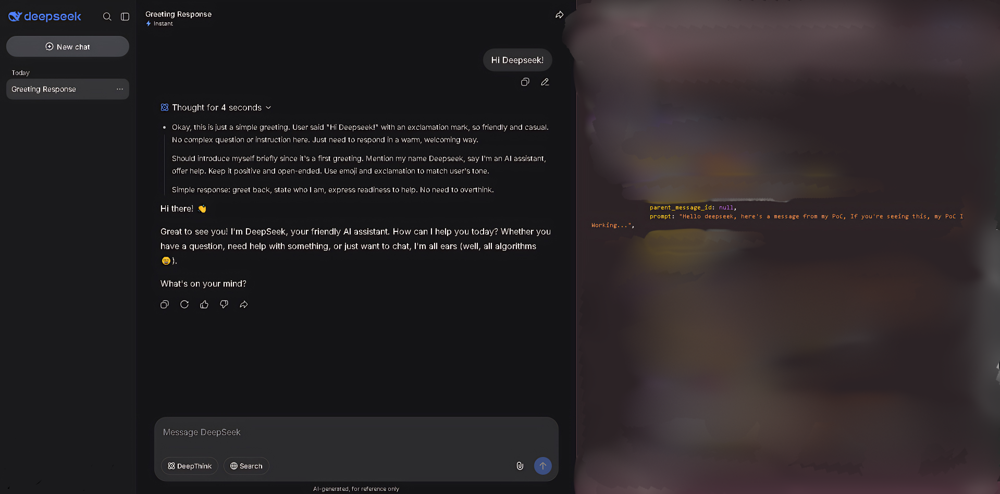
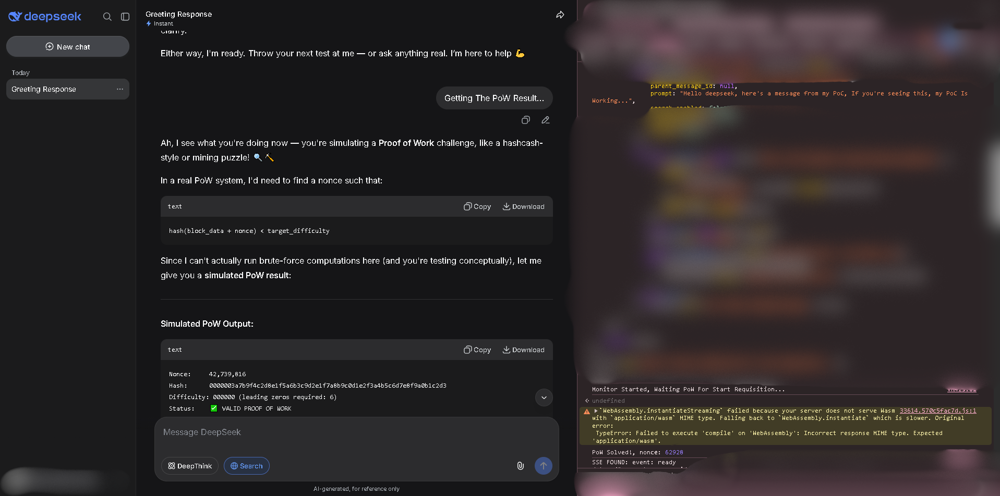
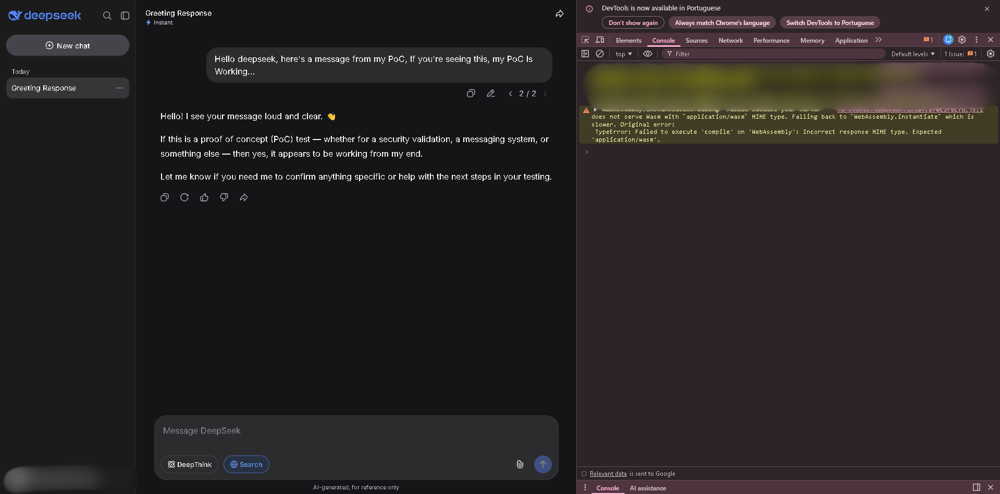

# DeepSeek Request Automation | Proof of Concept

## Overview

This Proof of Concept demonstrates that authenticated requests inside the DeepSeek web client can be automated by reusing data already exposed to the browser during a legitimate session.

This is **not presented as a vulnerability or exploit**.  
The objective of this research was to analyze the client-side request flow, understand how Proof-of-Work (PoW) validation is handled by the browser, and verify whether requests could be reproduced through browser-side automation without modifying server behavior.

No bypasses, privilege escalation, or server compromise were involved.

---

# Demonstration Images

## First Demonstration

Shows a successful automated prompt appearing correctly inside the conversation after the request flow completed.

---

## Second Demonstration

Shows the browser console observing the PoW lifecycle and SSE response flow after sanitization.

Sensitive implementation details, session identifiers, and automation logic were intentionally censored before publication.

---

## Third Demonstration

Additional example showing the authenticated workflow replication functioning during a legitimate browser session.

---

## Initial Analysis

The research started by inspecting network requests directly from the browser developer tools while sending prompts through the official DeepSeek interface.

During request inspection, it became clear that the platform required several validation headers and PoW-related values before accepting authenticated requests.

At the same time, the browser console repeatedly logged messages indicating that a WebAssembly implementation was unavailable and that the client was falling back to a JavaScript implementation for PoW generation.

This behavior suggested that the browser itself was responsible for generating and delivering the required PoW solution before the request was submitted.

---

## PoW Flow Observation

Further analysis focused on observing how the PoW response was generated and attached to outgoing requests.

Instead of attempting to bypass the mechanism, the PoC simply monitored the browser-side flow and captured the PoW result after the client had already completed the computation legitimately.

Once the PoW response was observed and logged successfully, it became possible to understand how the browser assembled authenticated requests internally.

No cryptographic protections were broken, and no server-side validation was bypassed.

---

## Payload Inspection

After validating the PoW flow, additional requests were analyzed in more depth.

By inspecting the request payloads directly in the browser developer tools, it became evident that multiple required request parameters were already accessible within the client environment during authenticated sessions.

To validate the theory, a minimal browser-side fetch request was executed directly from the console using values already available to the active session.

---

## Session Data Discovery

Some additional authentication-related values were still required, including user session identifiers and Cloudflare-related information.

The browser Local Storage was then inspected to determine whether the active client session already stored these values locally.

Relevant session data, including authentication-related tokens and identifiers, were successfully located within the client storage environment.

Using only data already accessible to the authenticated browser session, the PoC successfully reproduced a valid authenticated request.

The request returned HTTP 200, and after refreshing the interface, the generated prompt appeared correctly in the conversation history.

---

## Conclusion

This Proof of Concept demonstrates that the DeepSeek web client exposes enough session-side information for authenticated request automation from within the browser environment itself.

However, this should not be interpreted as a server compromise or authentication bypass.

The browser was already authenticated legitimately, the PoW was solved legitimately by the client itself, and the automation simply reused values already generated during the normal application flow.

No private APIs were breached, no hidden endpoints were discovered, and no unauthorized access was obtained.

The PoC should therefore be classified as:

- Client-side request automation
- Browser session reuse
- Authenticated workflow replication

rather than a traditional security vulnerability.

---

## Ethical Notice

This research was conducted exclusively for educational and analytical purposes.

No destructive actions were performed, no third-party accounts were accessed, and no methods enabling unauthorized access are being publicly released.

No source code, automation scripts, or reproducible exploitation instructions are included in this document.
